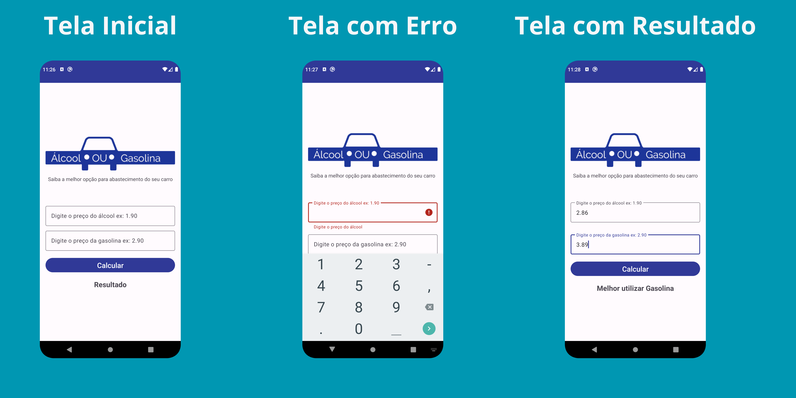

# Aplicativo Álcool ou Gasolina

Aplicativo desenvolvido no Android Studio utilizando a linguagem Kotlin com o objetivo de realizar um cálculo baseado no preço do álcool e da gasolina e informar ao usuário qual a melhor opção.

Feito durante o curso de [Desenvolvimento Android Completo 2023 - Kotlin & Java](https://www.udemy.com/course/desenvolvimento-android-completo/).

## Screenshot

## License

Para acessar o arquivo de licença [clique aqui](./license).
